# Penguin Mail

A Gmail client for the GNOME desktop, written in Rust. It keeps several Gmail
accounts in sync from the system tray, shows them in one inbox or one at a
time, and keeps your mail on your own computer.

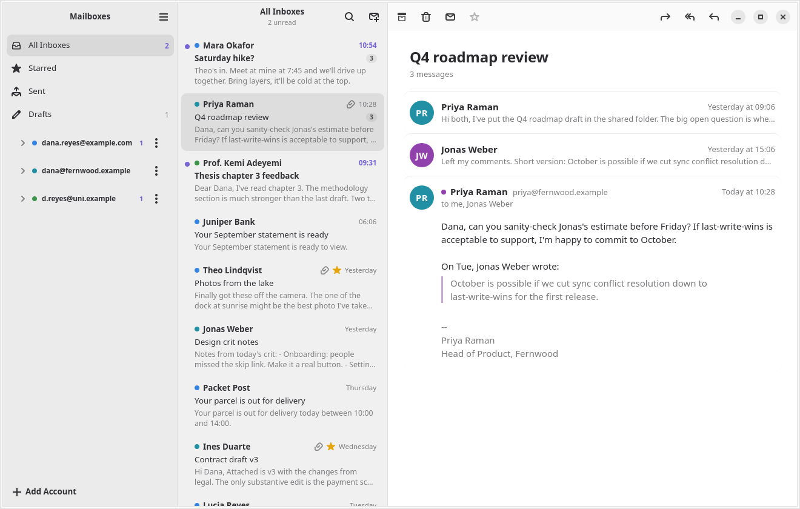

## What it does

- **One inbox for every account**, plus each account's Inbox, Flagged, Sent,
  Drafts, and labels. A colored dot tells accounts apart.
- **Conversations in one view.** Older messages fold down to a line; quoted
  text and signatures are dimmed. HTML mail renders in its own sandbox with
  scripts off and remote images blocked until you ask for them.
- **A composer that shows formatting as you write it.** Bold reads as bold,
  not as asterisks. Recipients are chips, Cc and Bcc stay hidden until you
  want them, and attachments list their sizes. Replies, reply-all, and
  forwards thread correctly in Gmail, and drafts save to Gmail with their
  formatting, so they follow you to your phone and come back whole.
- **OpenPGP and S/MIME through your own GnuPG.** A signed message names its
  signer above the text and says how far the trust database vouches for
  that key, or how far the certificate's chain reaches; one that changed on
  the way says so and stays on screen. An encrypted message opens and
  carries a mark saying it arrived that way, and so does the blob Outlook
  sends with the message inside its own signature. The composer has one
  Sign and one Encrypt, whichever standard the message ends up going out
  under, and offers Encrypt once every recipient has a key or a
  certificate, naming the ones with neither. Penguin Mail holds no key and
  asks for no passphrase: gpg, gpgsm, their agent and their pinentry do.
  With neither program installed, none of this appears.
- **Gmail search**, with its full query syntax, across one account or all.
- **Junk, Trash, and All Mail**, for every account together or one at a
  time, read live from Gmail. Not Junk and Move to Inbox put mail back.
  In the Trash, Delete Forever erases mail through Gmail. Penguin Mail asks
  Google for that permission the first time you use it, never at sign-in,
  and asks you to confirm each time, since nothing can undo it.
- **Recipient suggestions** in To and Cc, from people you have written to
  and heard from.
- **Undo Send and Send Later.** Sent mail waits a few seconds with an Undo
  button (Preferences sets how long). Send Later, on the arrow next to
  Send, schedules a message; it waits in Send Later and goes out on time
  while Penguin Mail runs, even in the tray.
- **An Outbox.** A message that cannot go out waits on this computer with
  the bytes it will be sent from, through a quit and a restart, and
  Penguin Mail tries again on a widening interval and as soon as the
  network comes back. The Outbox appears in the sidebar while it holds
  anything; a row says why the message has not gone and when the next try
  is, and you can edit it, send it now, or delete it. What another try
  would not fix comes back to you instead: a refused recipient, a message
  over Gmail's size limit, a sign-in that has run out.
- **Markdown when you want it.** Format Markdown turns Markdown in the body
  into formatted text; Edit as Markdown goes back. Preferences sets which
  one new messages start in. Paste, drop, or insert images into the text.
- **Tray and notifications.** An unread count in the tray and a notification
  for new mail, which opens the thread when clicked.
- **Select several at once** with Ctrl+click, Shift+click, or Ctrl+A, then
  archive, trash, junk, flag, mark, or label them together. Every one of
  these can be undone with Ctrl+Z or the Undo button on the toast.
- **Flags in seven colors**, as in Apple Mail. The flag syncs through
  Gmail's star; the color stays on this computer. Flagged lists a mailbox
  for each color in use.
- **VIPs.** Add a sender to VIPs from the conversation's menu. Their mail
  gathers in a VIPs mailbox, their rows get a star, and notifications can
  be limited to them.
- **Smart Mailboxes**: saved conditions (sender, subject, words, label,
  age, size, attachments, unread, flagged) for all accounts or one. They
  search Gmail, so they reach past the mail kept on this computer.
- **Remind Me** takes a conversation out of the inbox and brings it back,
  unread, in an hour, tonight, tomorrow, Monday, or when you choose.
- **Search suggestions** as you type: subject, people, and labels.
- **Arrange the sidebar.** Move accounts up or down, rename them, and pick
  their color. Give labels a color from Gmail's palette.
- **Labels.** Add or remove Gmail labels from the toolbar or with `l`.
  Nested labels show as a tree under their account. Create labels from the
  label menu or the account menu; right-click one to rename or delete it.
- **Drag and drop.** Drag mail onto any mailbox or label to move it there.
- **Unsubscribe and Block Sender.** List mail shows an Unsubscribe banner
  that uses the list's one-click link when it has one. Block Sender sends
  the address's future mail to the Trash with a Gmail filter.
- **Rules**: Gmail's filters, listed in plain words, with a form to add
  one. Gmail runs them, so they work with the computer off.
- **Print, View Source, and Open in New Window** from the ⋮ menu, Ctrl+P,
  Ctrl+Alt+U, and a double-click or Ctrl+O.
- **Export.** Save a conversation as an mbox file from the ⋮ menu, or
  right-click rows in the list to write a whole selection to one file.
  View Source saves a single message as `.eml`. `penguin-mail-cli export`
  writes either from a terminal.
- **Automatic replies.** Turn Gmail's out-of-office reply on from an
  account's ⋮ menu, with a subject, message, and optional dates. Gmail sends
  it, so it works with the computer off.
- **An assistant** (Ctrl+J) in a pane on the right. Ask it to summarize,
  sort, clean up, draft replies, or change settings such as an
  out-of-office reply, and it does the work with the app's own tools. It
  runs on a local model (LM Studio, Unsloth Studio, Ollama, or any
  OpenAI-compatible server), an Anthropic API key, or your Claude
  subscription through Claude Code, which Penguin Mail finds on its own.
  It asks before it sends mail or changes Gmail settings.
  [docs/assistant.md](docs/assistant.md) covers setup.
- **Categories.** A bar above the inbox splits it into Primary, Updates,
  Promotions, and Social, using Gmail's own categories. Categorize Sender,
  in a conversation's ⋮ menu, moves a sender to another category for good.
- **Follow Up.** Mail you sent that has had no answer for three days shows
  in a Follow Up mailbox and a banner over the inbox, until someone
  replies or you dismiss it.
- **Hide My Email.** Make a plus address, such as
  `you+kelp.ember795@gmail.com`, for each site you sign up to. Its mail
  gets a label, and you can turn the address off to send its mail to the
  Trash. Your real address stays visible inside it, so this stops lazy
  spam, not a determined sender.
- **Apple Mail's shortcuts**, with Ctrl in place of Command, plus Gmail's
  single keys.
- **Preferences** (`Ctrl+,`): group messages into conversations or list each
  one, when to mark as read, remote images, text size, light or dark, a
  default sending account, a Markdown signature per account (or the one you
  already set in Gmail, one click to import), notification
  previews, how often to check and how much mail to keep, and starting at
  login.
- **Light.** In the tray, Penguin Mail uses about 55 MB. A minute after you close
  the window, it restarts itself in the background to give back the memory
  the window used.

| Dark | Writing | Narrow |
|---|---|---|
| 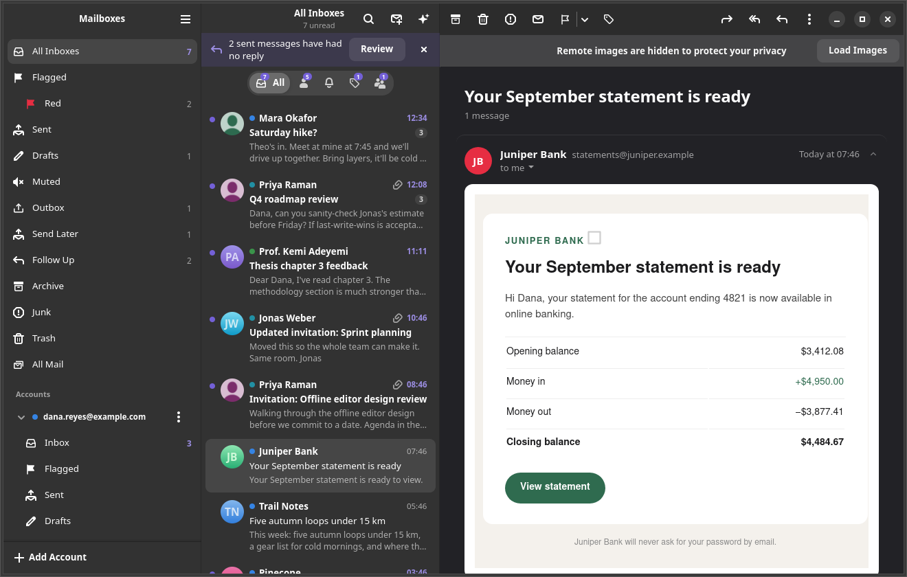 | 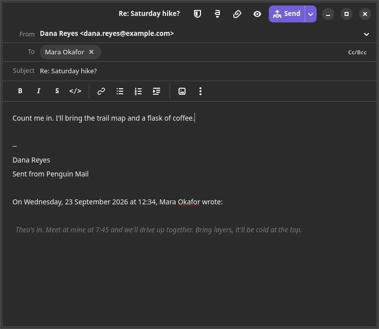 | 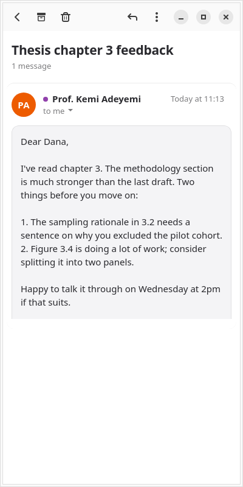 |

| Several selected | Automatic reply |
|---|---|
| 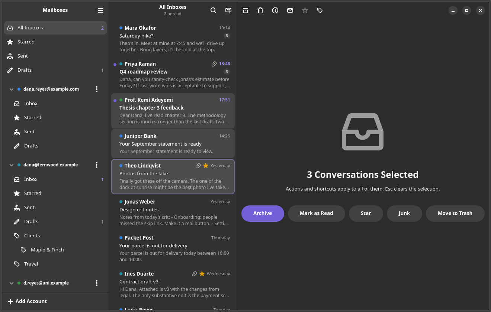 | 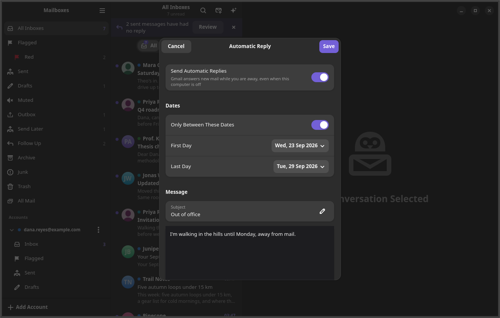 |

| Flags | VIPs |
|---|---|
| 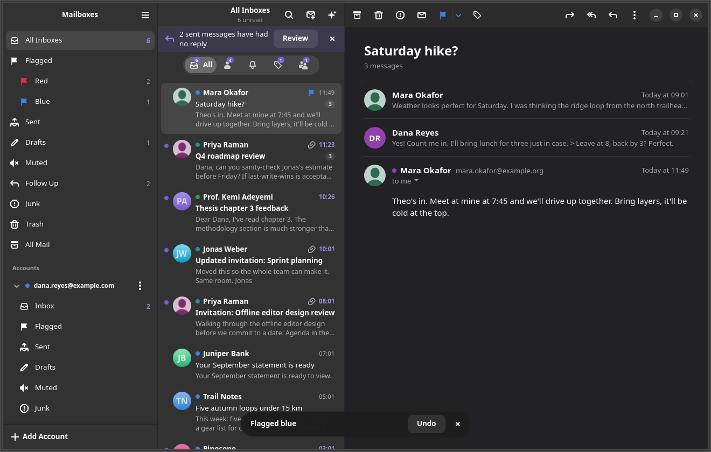 | 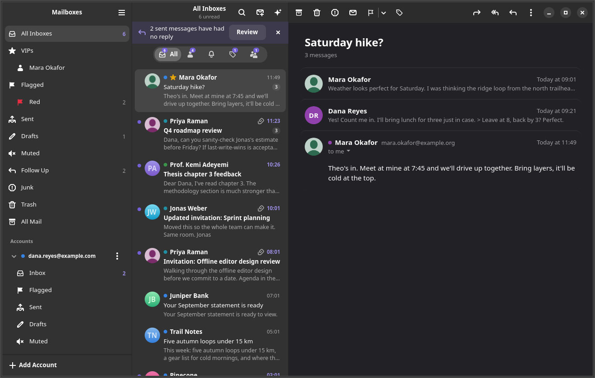 |

| Assistant | Categories |
|---|---|
| 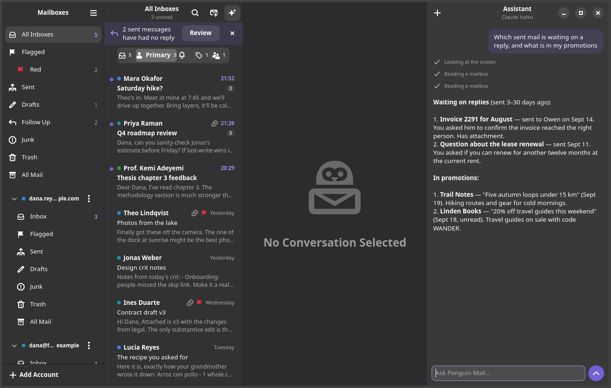 | 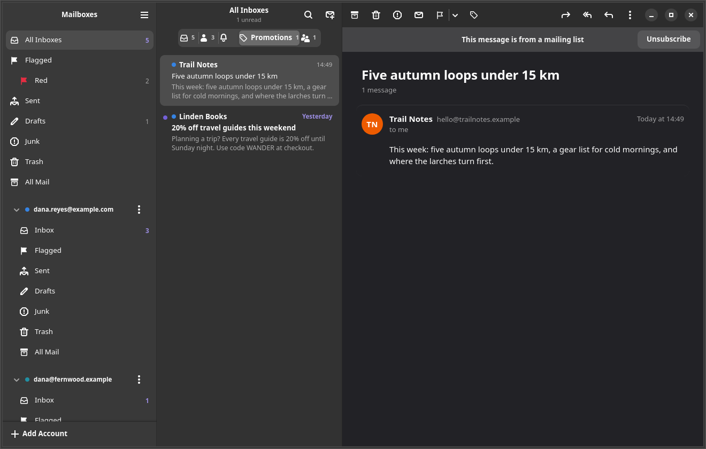 |

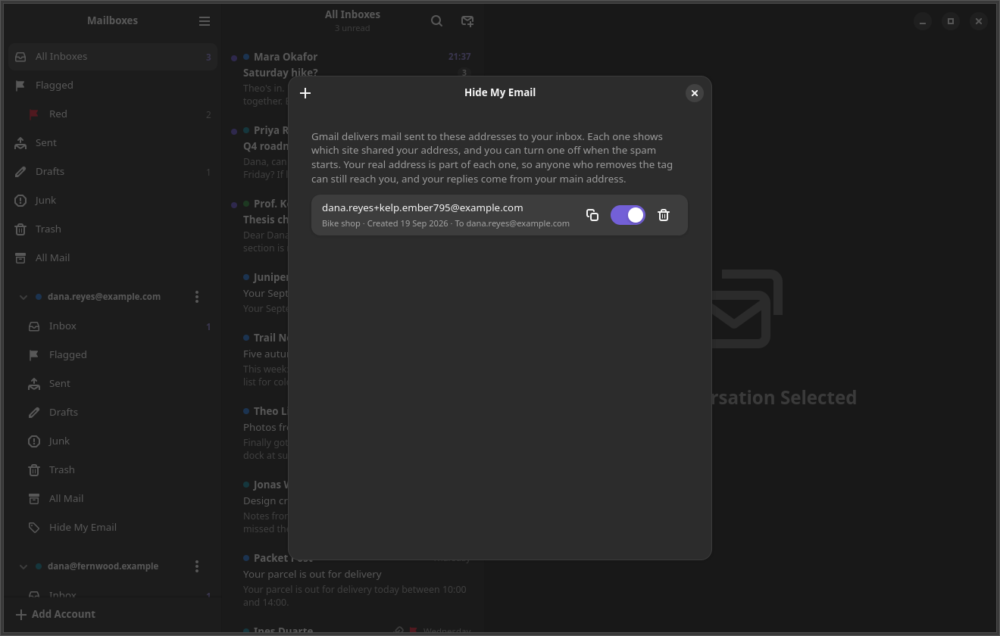

| Send Later | Rules |
|---|---|
| 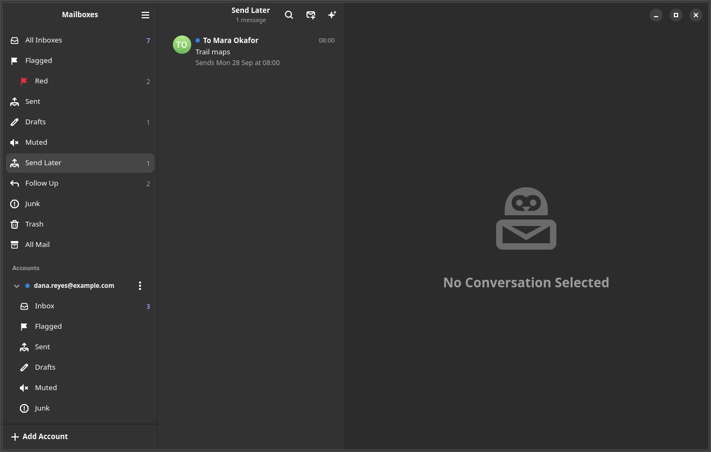 | 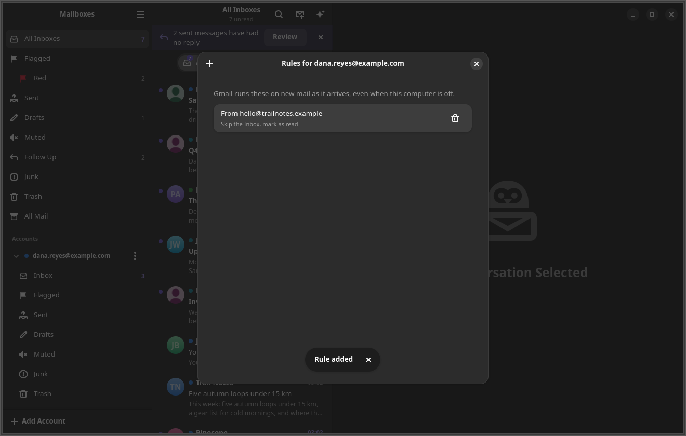 |

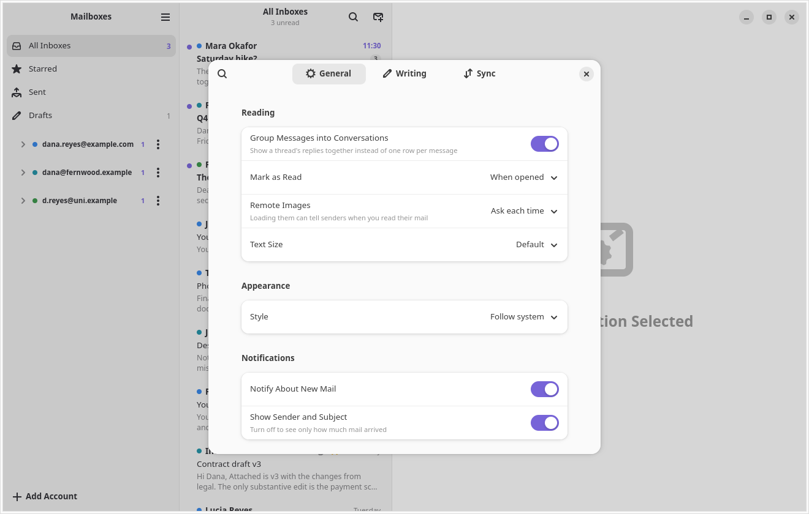

## Try it without an account

```sh
cargo run --release -p mailrs -- --demo
```

Demo mode opens three sample accounts in a throwaway store. Everything works
except talking to Google: search, triage, the composer, and attachments all
run against local sample data.

## Install

Penguin Mail targets Ubuntu 26.04 (GTK 4.20 or newer, libadwaita 1.8, WebKitGTK
6.0) and Rust 1.98.

```sh
sudo apt install libgtk-4-dev libadwaita-1-dev libwebkitgtk-6.0-dev libglib2.0-dev-bin
scripts/install.sh
```

The script installs `penguin-mail` and `penguin-mail-cli` into
`~/.local/bin`, adds the app to your launcher, and starts it in the tray at
login (`NO_AUTOSTART=1` skips that). `scripts/uninstall.sh` removes it again.

Penguin Mail used to be called mailrs. The install script removes the old
`mailrs` binaries and launcher and keeps your login item setting. On first
start, the app moves `~/.config/mailrs`, `~/.local/share/mailrs`, and
`~/.cache/mailrs` to `penguin-mail`, and your accounts stay signed in.

Then open Penguin Mail. The first screen asks for a Google OAuth client ID and
secret, which you create once in your own Google Cloud project;
[docs/setup.md](docs/setup.md) walks through it in about ten minutes. After
that, **Sign In with Google** adds each account.

## Keyboard

Apple Mail's shortcuts work with Ctrl in place of Command. Gmail's single
keys work too, whenever you are not typing.

| Key | Action | Key | Action |
|---|---|---|---|
| `j` / `k` | Next / previous conversation | `Ctrl+R` or `r` | Reply |
| `Ctrl+Alt+A` or `e` | Archive | `Ctrl+Shift+R` or `a` | Reply all |
| `Delete` or `#` | Move to trash | `Ctrl+Shift+F` or `f` | Forward |
| `Ctrl+Shift+J` | Junk | `Ctrl+N` or `c` | New message |
| `Ctrl+Shift+L` or `s` | Flag or unflag | `Ctrl+Shift+D` | Send |
| `Ctrl+Alt+1` to `Ctrl+Alt+7` | Flag color | | |
| `Ctrl+Shift+U` or `u` | Mark read or unread | `Ctrl+Shift+A` | Attach files |
| `Ctrl+Alt+M` or `l` | Labels | `Ctrl+B` / `Ctrl+I` / `Ctrl+K` | Bold, italic, link |
| `Ctrl+Z` | Undo | `Ctrl+F` or `/` | Search |
| `Ctrl+A` | Select all | `Ctrl+1` to `Ctrl+9` | Open a mailbox |
| `Ctrl+Shift+N` or `F5` | Check for mail | `Ctrl+=` / `Ctrl+-` / `Ctrl+0` | Text size |
| `Ctrl+O` or double-click | Open in a new window | `Ctrl+P` | Print |
| `Ctrl+Alt+U` | View source | `Ctrl+?` | Every shortcut |

`Ctrl+?` shows them all.

## From the command line

```sh
penguin-mail --background             # start in the tray, no window
penguin-mail --compose                # new message
penguin-mail mailto:ann@example.com   # new message to Ann
```

To make Penguin Mail open `mailto:` links:
`xdg-mime default dev.penguinmail.PenguinMail.desktop x-scheme-handler/mailto`

The running app also answers D-Bus actions, handy for custom shortcuts:

```sh
gdbus call --session --dest dev.penguinmail.PenguinMail --object-path /dev/penguinmail/PenguinMail \
    --method org.gtk.Actions.Activate show-window [] {}
```

The actions are `show-window`, `hide-window`, `compose`, `check`, and `quit`.

`penguin-mail-cli` drives the same sync core without a window: `account add`,
`sync`, `threads`, `show`, and `triage`. It is handy for debugging.

## Privacy

- Penguin Mail talks only to Google's Gmail API, through an OAuth client that you
  own. Nobody else's server sees your mail.
- Refresh tokens live in the GNOME keyring. The config file holds only the
  client ID and secret, and Penguin Mail writes it readable by you alone.
- Mail is cached in `~/.local/share/penguin-mail`: the last 30 days, plus
  everything in your inbox. Opening an older thread fetches it on demand.
- The assistant is off until you pick a model. A local model keeps mail on
  your computer; the Anthropic API and Claude Code send what the assistant
  reads to Anthropic. API keys live in the GNOME keyring.
- Email is shown with JavaScript off, and with remote content blocked twice:
  by a WebKit content filter and by the page's own Content-Security-Policy.
  Loading images is a per-conversation choice.

## How it is built

```
domain/   shared types, Gmail's label names, categories
gmail/    Gmail REST client, OAuth, quota limiter
store/    SQLite schema and queries
sync/     one sync loop per account: bootstrap, history replay, backfill
          mail actions, mailbox listing, and each account's Gmail settings
pgp/      OpenPGP mail through the person's own gpg: signatures and
          encryption, RFC 3156 parts, inline armor
smime/    S/MIME mail through their gpgsm: the same questions in the
          shapes RFC 8551 gives them
ai/       model providers, tool calls, the Claude Code bridge
cli/      penguin-mail-cli
app/      the GTK4 and libadwaita app
```

Windows and dialogs stay thin. Archiving, flagging, listing a mailbox, and
changing an automatic reply each live in one module in `sync`, which the
window and the assistant both call, so the two cannot drift apart. Those
modules take an account lookup and the store, so their tests run against an
in-memory database and a fake Gmail with no window on screen. The terms the
code uses are defined in [CONTEXT.md](CONTEXT.md).

Sync follows Gmail's history API, polling every 30 seconds per account, so a
change made on your phone shows up here within half a minute. When history
runs out, the account re-lists its mail and removes anything deleted in the
gap. The design and its trade-offs are written up in
[docs/superpowers/specs/](docs/superpowers/specs/2026-09-17-gmail-client-design.md).

## Development

```sh
cargo test --workspace                          # about 700 tests, no network
cargo clippy --workspace --all-targets -- -D warnings
cargo run -p mailrs -- --demo                   # the UI with sample data
scripts/smoke.sh                                # by hand, against a real account
```

The OpenPGP and S/MIME tests sign and encrypt through the GnuPG on this
computer, in a keyring they build under a temporary directory and throw
away. Without `gpg` or `gpgsm` on PATH they skip, so the suite still runs
on a computer that has neither. A build machine should set
`PENGUIN_MAIL_REQUIRE_CRYPTO=1`, which turns that skip into a failure
rather than a green run that tested nothing.

## The icon

A penguin holding a letter, on the rounded square the Gruvbox Plus icon
pack puts every app on: the pack's own superellipse and bevel, a taupe
gradient behind a cream bird and envelope, and an orange beak. Drawn at
256 like the rest of that pack, so it sits among them rather than beside
them.
