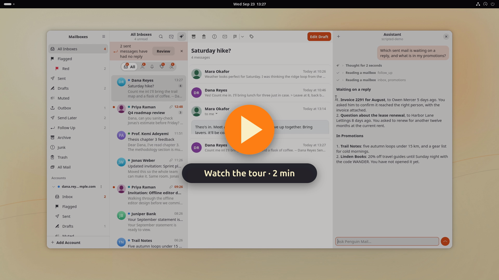

<div align="center">


# Penguin Mail

A Gmail client for the GNOME desktop, written in Rust.

[](https://github.com/c9dev/penguin-mail/actions/workflows/ci.yml)
[](https://github.com/c9dev/penguin-mail/releases/latest)
[](LICENSE)
[](https://www.rust-lang.org)
[](https://gnome.pages.gitlab.gnome.org/libadwaita/)

[Watch the tour](https://youtu.be/0PyJCsw1FSE) · [Install](#install) · [Features](#features) · [Screenshots](#screenshots) · [Changelog](CHANGELOG.md)

</div>

Penguin Mail keeps several Gmail accounts in sync from the system tray,
shows them in one inbox or one at a time, and keeps your mail on your own
computer. It talks to Google directly, signed in with your Google account,
so no other server sees your mail.

[](https://youtu.be/0PyJCsw1FSE)

## Features

### Reading

- **One inbox for every account**, plus each account's Inbox, Flagged,
  Sent, Drafts and labels. A colored dot tells accounts apart.
- **Conversations in one view.** Older messages fold down to a line, and
  quoted text and signatures are dimmed. HTML mail renders in its own
  sandbox with scripts off and remote images blocked until you ask for them.
- **Categories.** A bar above the inbox splits it into Primary, Updates,
  Promotions and Social, using Gmail's own categories. Categorize Sender
  moves a sender to another category for good.
- **Gmail search** with its full query syntax, across one account or all,
  with suggestions for subjects, people and labels as you type.
- **Junk, Trash and All Mail**, for every account or one, read live from
  Gmail. Delete Forever asks Google for that permission the first time you
  use it, never at sign-in, and asks you to confirm each time.

### Writing

- **A composer that shows formatting as you write.** Recipients are chips,
  Cc and Bcc stay hidden until you want them, and attachments list their
  sizes. Replies and forwards thread correctly in Gmail, and drafts save to
  Gmail with their formatting, so they follow you to your phone.
- **Markdown when you want it.** Format Markdown turns Markdown in the body
  into formatted text, and Edit as Markdown goes back. Paste, drop or insert
  images into the text.
- **Recipient suggestions** from your contacts and the people you have
  written to or heard from.
- **Undo Send and Send Later.** Sent mail waits a few seconds with an Undo
  button. Send Later schedules a message, which goes out on time while
  Penguin Mail runs, even in the tray.
- **An Outbox.** A message that cannot go out waits on this computer through
  a quit and a restart, and Penguin Mail tries again on a widening interval
  and as soon as the network comes back. Problems another try would not fix,
  such as a refused recipient or a message over Gmail's size limit, come
  back to you instead.
- **Templates** you drop in at the cursor, and a spelling check while you
  write.

### Organizing

- **Select several at once** with Ctrl+click, Shift+click or Ctrl+A, then
  archive, trash, junk, flag, mark or label them together. Ctrl+Z undoes
  each one.
- **One message at a time.** Right-click a message inside a conversation
  to reply to it, archive it, trash it, mark it, flag it, label it or
  export it on its own. The rest of the thread stays where it is.
- **Flags in seven colors**, as in Apple Mail. The flag syncs through
  Gmail's star, and the color stays on this computer.
- **VIPs.** Their mail gathers in a VIPs mailbox, their rows get a star, and
  notifications can be limited to them.
- **Smart Mailboxes**: saved conditions such as sender, subject, label, age,
  size or attachments, for all accounts or one. They search Gmail, so they
  reach past the mail kept on this computer.
- **Remind Me** takes a conversation out of the inbox and brings it back,
  unread, when you choose. **Follow Up** lists mail you sent that has had no
  answer for three days. **Mute** keeps a noisy thread out of the inbox.
- **Labels** from the toolbar or with `l`, nested as a tree under their
  account. Drag mail onto any mailbox or label to move it there.
- **Export** a conversation or a selection as mbox, or one message as `.eml`.

### Gmail settings

- **Rules**: Gmail's filters, listed in plain words, with a form to add one.
- **Automatic replies** with a subject, message and optional dates.
- **Unsubscribe and Block Sender.** List mail shows an Unsubscribe banner
  that uses the list's one-click link when it has one.
- **Hide My Email.** Make a plus address, such as
  `you+kelp.ember795@gmail.com`, for each site you sign up to, and turn it
  off to send its mail to the Trash. Your real address stays visible inside
  it, so this stops lazy spam, not a determined sender.

Gmail runs all four, so they work with your computer off.

### Security and privacy

- **OpenPGP and S/MIME through your own GnuPG.** A signed message names its
  signer and says how far your trust database or the certificate chain
  vouches for it. An encrypted message opens and says it arrived that way.
  The composer has one Sign and one Encrypt for both standards and offers
  Encrypt once every recipient has a key. A Bcc stays blind under OpenPGP,
  which leaves that reader's key out of the message; S/MIME cannot, so a
  message with a Bcc is not encrypted under it. A draft of an encrypted
  message waits in Gmail encrypted to your own key, and opens again in the
  composer with Encrypt on. Penguin Mail holds no key and asks for no
  passphrase: gpg, gpgsm and their pinentry do.
- **Remote content blocked twice**, by a WebKit content filter and by the
  page's own Content-Security-Policy, with JavaScript off. Loading images is
  a choice per conversation, or per sender.
- **Invitations** show as a card above the message, and you can accept,
  decline or propose another time.

### The assistant

An assistant pane (Ctrl+J) summarizes, sorts, cleans up, drafts replies and
changes settings such as an automatic reply, using the app's own tools. It
also reads and changes your Google Calendar, finds free time, looks people
up in your contacts, and reads attachments.

- **Any model, per job.** It runs on a local model (LM Studio, Ollama, or
  any OpenAI-compatible server), an Anthropic API key, or your Claude
  subscription through Claude Code, and translation can use a different
  model from the assistant.
- **You see the work.** Each answer shows the model's thinking and every
  tool it ran, folded up until you open them, and a line saying what it is
  doing right now.
- **Web search**, through Claude's own search or, for a local model, Brave
  Search or your own SearXNG.
- **MCP servers** you add give it more tools, and **skills** teach it your
  routines. A skill's scripts run in a sandbox with no access to your mail,
  keys or home folder.

It asks before it sends mail, changes Gmail settings or your calendar, or
uses a tool from outside the app, and it is off until you pick a model.
[docs/assistant.md](docs/assistant.md) covers setup.

### On the desktop

- **Tray and notifications.** An unread count in the tray, and new-mail
  notifications with Archive, Mark Read, Delete and Reply buttons.
- **Light on memory.** In the tray Penguin Mail uses about 55 MB. A minute
  after you close the window, it restarts itself in the background to give
  back the memory the window used.
- **Apple Mail's shortcuts** with Ctrl in place of Command, plus Gmail's
  single keys.
- **English and European Portuguese**, chosen in Preferences, with the
  window's controls named for screen readers.

## Screenshots


| Dark | Writing | Narrow |
|---|---|---|
|  |  |  |

| Several selected | Automatic reply |
|---|---|
|  |  |

| Flags | VIPs |
|---|---|
|  |  |

| Assistant | Categories |
|---|---|
|  |  |

| Send Later | Rules |
|---|---|
|  |  |

| Hide My Email | Preferences |
|---|---|
|  |  |

## Install

Penguin Mail runs on Linux, x86_64. The .deb and the rpm need GTK 4.20,
libadwaita 1.8 and WebKitGTK 6.0 from your distribution, as Ubuntu 26.04
and Fedora 43 have; the snap brings its own. Penguin Mail is not on
Flathub yet. The tray icon needs a StatusNotifier host, which Ubuntu's
AppIndicator extension provides.

| | .deb | rpm | Snap |
|---|---|---|---|
| Updates | Install in the app, or `apt upgrade` | `dnf upgrade` | Snap Store |
| GnuPG | the system's | the system's | the snap's, on your `~/.gnupg` |
| Assistant skills | yes | yes | no |
| Claude Code, and MCP servers you run as a command | yes | yes | no |
| Tray icon | yes | yes | yes |

Skills are off in the snap because a skill's scripts run in a sandbox of
their own, which cannot start inside the one the snap runs in. That
sandbox also keeps the app from starting programs installed on your
system, such as Claude Code. [docs/setup.md](docs/setup.md#which-package)
has the details.

### With apt (recommended on Ubuntu)

Penguin Mail has its own apt repository. Add its key and entry, then
install:

```sh
sudo curl -fsSLo /usr/share/keyrings/penguin-mail-archive-keyring.gpg \
  https://c9dev.github.io/penguin-mail/penguin-mail-archive-keyring.gpg
sudo curl -fsSLo /etc/apt/sources.list.d/penguin-mail.sources \
  https://c9dev.github.io/penguin-mail/penguin-mail.sources
sudo apt update && sudo apt install penguin-mail
```

`sudo apt upgrade` then brings each new version with the rest of the
system. The key's fingerprint is
`FE3C 3B6E 699A F939 DC46 70DC F3A8 5303 5C3E 2B8E`.

### From a release

Download the `.deb` from the
[latest release](https://github.com/c9dev/penguin-mail/releases/latest) and
install it, replacing `X.Y.Z` with the version:

```sh
sudo apt install ./penguin-mail_X.Y.Z_amd64.deb
```

apt pulls in the libraries it needs. The `.deb` also adds the apt
repository above, so later versions arrive with `sudo apt upgrade`.

### Without root

The same release has a tarball and a zip that install under `~/.local`:

```sh
tar xzf penguin-mail-X.Y.Z-x86_64.tar.gz
cd penguin-mail-X.Y.Z-x86_64
./install-files.sh .
```

It starts in the tray at login unless you run it as
`NO_AUTOSTART=1 ./install-files.sh .`.

To check a download, fetch the release's `SHA256SUMS` and
`SHA256SUMS.asc` and the apt repository's key from above, then:

```sh
gpgv --keyring ./penguin-mail-archive-keyring.gpg SHA256SUMS.asc SHA256SUMS
sha256sum -c --ignore-missing SHA256SUMS
```

### With dnf, on Fedora

Penguin Mail has a dnf repository beside the apt one, signed with the same
key:

```sh
sudo curl -fsSLo /etc/yum.repos.d/penguin-mail.repo \
  https://c9dev.github.io/penguin-mail/rpm/penguin-mail.repo
sudo dnf install penguin-mail
```

dnf asks you to accept the key the first time. `sudo dnf upgrade` brings
each new version, and the `.rpm` on the releases page adds the repository
too.

### From the Snap Store

```sh
sudo snap install penguin-mail --edge
```

The snap waits for the Snap Store to approve its access to `~/.gnupg` and
to the keyring, and the command above finds it once the store has. New
versions reach the edge channel first. The snap is strictly confined, and
signing and encryption use your own keys.

### From source

[CONTRIBUTING.md](CONTRIBUTING.md#building-from-source) has the steps, and
how to build the Flatpak yourself.

### First run

The first screen signs you in with Google. **Sign In with Google** opens
Google's sign-in page in your browser, and **Add Account** in the sidebar adds
each account after that.

Until Google finishes verifying Penguin Mail, that page warns that Google has
not verified the app. The warning means Google has not yet reviewed the app's
request for Gmail access; choose **Advanced**, then continue.

### Updates

A Penguin Mail installed from the .deb, the tarball or source checks GitHub
for a new release once a day. When one is out, it says so in a
notification, a banner across the window, and the tray menu, and
**Install** does the rest:

- **From the .deb or the apt repository**, it downloads the new `.deb` and
  installs it with apt. GNOME asks for your password, because apt changes
  files under `/usr`. `sudo apt upgrade` installs the same version, if you
  would rather update that way.
- **From the tarball or from source**, it downloads the new tarball and
  installs it into the same folder as before, with no password.

Before it installs anything, Penguin Mail checks that the release's
`SHA256SUMS` carries a good signature from the apt repository's key,
which is built into the app, and then checks the download against those
sums. It refuses a release whose signature is missing or made by any
other key, and the update log says so. Once the new version is in,
Penguin Mail restarts into it. With a message open in
the composer, it waits and shows **Restart** instead, since a draft saves
only when you save it.

**Check for Updates** in the tray menu checks at once. To stop the daily
check, turn off **Check for Updates** under Preferences, Startup. A copy run
with `cargo run` or as the demo never checks.

The rpm leaves updates to dnf, and the snap to the Snap Store. Those
copies never check GitHub and offer no Install of their own; Preferences
and the About window say who brings updates.

To update by hand, download the new release and install it the same way as
the first time. For a copy built from source, pull and run
`scripts/install.sh` again.

### Try it without an account

```sh
penguin-mail --demo
```

The demo opens three sample accounts in a throwaway store. Search, triage,
the composer and attachments all work against sample data, and nothing
talks to Google.

## Usage

### Keyboard

Apple Mail's shortcuts work with Ctrl in place of Command. Gmail's single
keys work whenever you are not typing. `Ctrl+?` lists every shortcut.

| Key | Action | Key | Action |
|---|---|---|---|
| `j` / `k` | Next / previous conversation | `Ctrl+R` or `r` | Reply |
| `Ctrl+Alt+A` or `e` | Archive | `Ctrl+Shift+R` or `a` | Reply all |
| `Delete` or `#` | Move to trash | `Ctrl+Shift+F` or `f` | Forward |
| `Ctrl+Shift+J` | Junk | `Ctrl+N` or `c` | New message |
| `Ctrl+Shift+L` or `s` | Flag or unflag | `Ctrl+Shift+D` | Send |
| `Ctrl+Alt+1` to `Ctrl+Alt+7` | Flag color | `Ctrl+Shift+A` | Attach files |
| `Ctrl+Shift+U` or `u` | Mark read or unread | `Ctrl+B` / `Ctrl+I` / `Ctrl+K` | Bold, italic, link |
| `Ctrl+Alt+M` or `l` | Labels | `Ctrl+F` or `/` | Search |
| `Ctrl+Z` | Undo | `Ctrl+1` to `Ctrl+9` | Open a mailbox |
| `Ctrl+A` | Select all | `Ctrl+=` / `Ctrl+-` / `Ctrl+0` | Text size |
| `Ctrl+Shift+N` or `F5` | Check for mail | `Ctrl+P` | Print |
| `Ctrl+O` or double-click | Open in a new window | `Ctrl+Alt+U` | View source |

### Command line

```sh
penguin-mail --background             # start in the tray, no window
penguin-mail --compose                # new message
penguin-mail mailto:ann@example.com   # new message to Ann
penguin-mail --version
```

To make Penguin Mail open `mailto:` links:

```sh
xdg-mime default io.github.c9dev.PenguinMail.desktop x-scheme-handler/mailto
```

The running app answers D-Bus actions, for custom shortcuts:

```sh
gdbus call --session --dest io.github.c9dev.PenguinMail --object-path /io/github/c9dev/PenguinMail \
    --method org.gtk.Actions.Activate show-window [] {}
```

The actions are `show-window`, `hide-window`, `compose`, `check` and `quit`.

`penguin-mail-cli` drives the same sync core without a window: `account add`,
`sync`, `threads`, `show`, `triage` and `export`.

## Privacy

- Penguin Mail talks to Google's APIs straight from your computer. No
  Penguin Mail server sits in between.
- Refresh tokens live in the GNOME keyring. The config file holds sync
  settings and, for accounts added through the old setup page, their Google
  client ID and secret, readable by you alone.
- Mail is cached in `~/.local/share/penguin-mail`: the last 30 days plus
  everything in your inbox. Opening an older thread fetches it on demand.
- The assistant is off until you pick a model. A local model keeps mail on
  your computer; the Anthropic API and Claude Code send what the assistant
  reads to Anthropic. API keys live in the GNOME keyring.

The full policy is in [docs/privacy-policy.md](docs/privacy-policy.md).

## Help and feedback

Questions, bug reports and ideas are welcome in
[Issues](https://github.com/c9dev/penguin-mail/issues).
[CONTRIBUTING.md](CONTRIBUTING.md) says what a useful report holds, and how
the code is built and tested. [SECURITY.md](SECURITY.md) says where to send
a vulnerability.

## License

Penguin Mail is free software under the
[GNU General Public License, version 3 or later](LICENSE).

The icon is a penguin holding a letter, drawn on the rounded square and
bevel of the Gruvbox Plus icon pack so it sits among that pack's apps.
